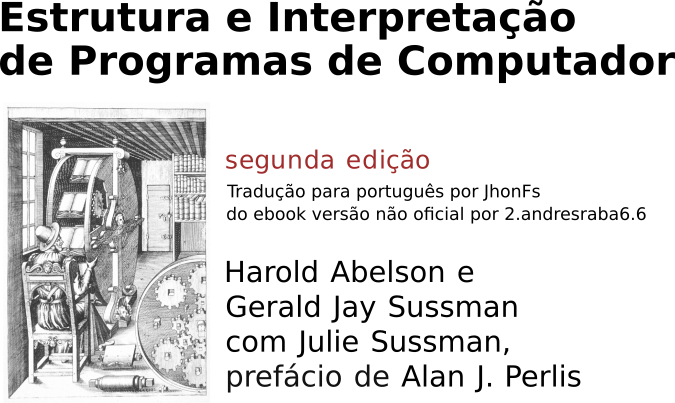

# Tradução para Português Brasileiro: Structure and Interpretation of Computer Programs (SICP)

---

Tradução completa do livro clássico de Ciência da Computação **Structure and Interpretation of Computer Programs (2ª Edição)**, de Harold Abelson e Gerald Jay Sussman com Julie Sussman, para o Português Brasileiro.

**Sobre o Livro:**

SICP é um texto fundamental em Ciência da Computação, conhecido por sua abordagem profunda sobre princípios de programação, abstração de software e projeto de sistemas. Utilizado por décadas no MIT, influenciou gerações de programadores e cientistas da computação.

**Objetivo desta Tradução:**

Tornar este material seminal acessível à comunidade de estudantes, professores e profissionais de língua portuguesa, facilitando o estudo e a disseminação desses conceitos importantes.

**Status:**

* [X] Tradução Completa do Conteudo (2ª Edição)
* [ ] Tradução da página HTML Term-Index
* [ ] Revisão em andamento (ou Concluída)
* [ ] Verção TextInfo, EPUB e PDF.

**Como Acessar:**

* **[Leia a tradução online (HTML/GitHub Pages) AQUI](https://jhonatafs.github.io/sicp-pt-br/)**

**Motivação:**

[Sua breve frase sobre motivação aqui - opcional, mas recomendado]

**Créditos:**

* **Autores Originais:** Harold Abelson, Gerald Jay Sussman, com Julie Sussman
* **Publicação Original:** MIT Press
* **Website Oficial do Livro:** [https://mitpress.mit.edu/sites/default/files/sicp/full-text/book/book.html](https://mitpress.mit.edu/sites/default/files/sicp/full-text/book/book.html)
* **Versão Não Oficial:** Andres Raba "sarabander"
* **Link do Projeto Não Oficial:** [https://github.com/sarabander/sicp](https://github.com/sarabander/sicp)

**Licença:**

Esta tradução é disponibilizada sob a licença Licença Internacional Creative Commons Atribuição-CompartilhaIgual 4.0 (cc by-sa). O conteúdo original e não oficial do livro possui sua própria licença, disponível no site oficial.

**Como Contribuir:**

Encontrou algum erro de digitação, tradução ou formatação? Sinta-se à vontade para abrir uma [Issue](https://github.com/Jhonatafs/sicp-pt-br/issues) ou submeter um [Pull Request](https://github.com/Jhonatafs/sicp-pt-br/pulls) com a correção proposta.

---

*Realizado por Jhonata F. Santos*
